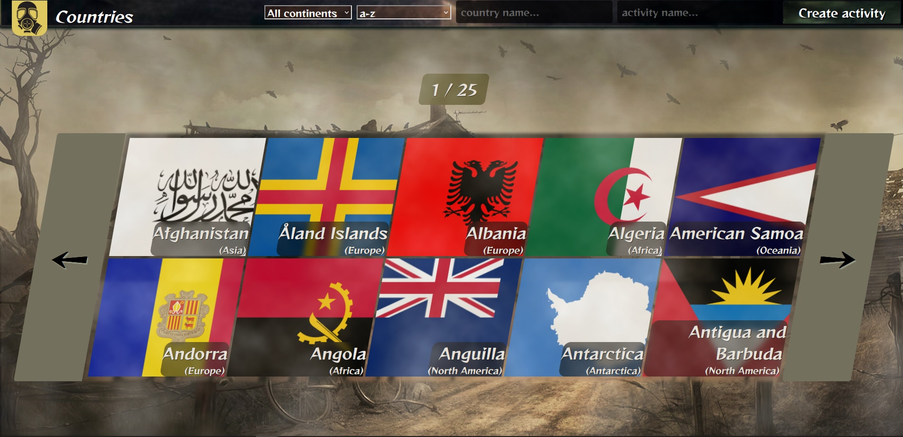
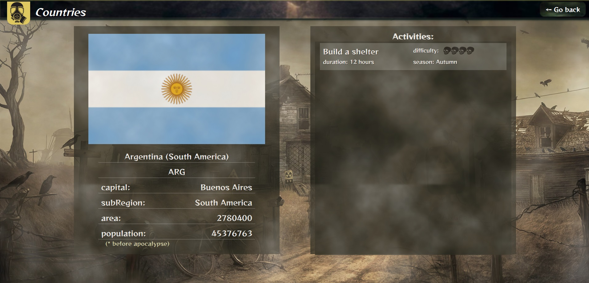

# CountriesPI

Proyecto realizado durante la cursada del bootcamp Henry. Utilizé React + Redux para el front y Express, PostgreSQL+ Sequelize para el back.

Deploy: https://comfy-banoffee-cf3cf4.netlify.app/

## Algunas imágenes:

